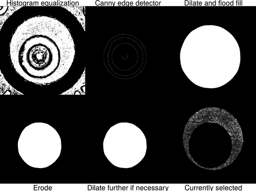

background-image: url("images/title-slide-bkgd.png")


<br> </br>

## A Cartridge Case Comparison Pipeline

### Oral Preliminary Exam

#### Joseph Zemmels

#### Iowa State University: Center for Statistics and Applications in Forensic Evidence

#### 2022-06-17

```{r, load_refs, include=FALSE, cache=FALSE}
library(RefManageR)
# remotes::install_github("ROpenSci/bibtex")
RefManageR::BibOptions(check.entries = FALSE,
                       bib.style = "authoryear",
                       cite.style = "alphabetic",
                       style = "markdown",
                       max.names = 1,
                       no.print.fields = c("urldate","file","issn","url","keywords","language","abstract"),
                       hyperlink = FALSE,
                       dashed = FALSE)
myBib <- RefManageR::ReadBib("ref.bib", check = FALSE)
```

```{r setup, include=FALSE}
library(tidyverse)
library(cmcR)
library(x3ptools)
library(patchwork)
source("code/supplementaryFunctions.R")

options(htmltools.dir.version = FALSE)

knitr::opts_chunk$set(echo = FALSE,
                      fig.align = 'center')
```

---

# Acknowledgements

## Funding statement

This work was partially funded by the Center for Statistics and Applications in Forensic Evidence (CSAFE) through Cooperative Agreement 70NANB20H019 between NIST and Iowa State University, which includes activities carried out at Carnegie Mellon University, Duke University, University of California Irvine, University of Virginia, West Virginia University, University of Pennsylvania, Swarthmore College and University of Nebraska, Lincoln.

---

## About Me

- Undergraduate at Winona State University in Winona, MN, 2013-2017

  - B.Sc. in Honors Mathematics and Mathematics: Secondary Education
  
- Graduate at Iowa State University, 2018-present

  - M.Sc. in Statistics, 2020
  
  - Creative Component: *Open-source implementation of the Congruent Matching Cells method for cartridge case identification*
  
- I hope to teach Statistics and Data Science at a post-secondary institution in the Denver area.


---

# Outline

- **Introduction** Firearms and Toolmarks Identification

- **Paper \#1** A Study in Reproducibility: The Congruent Matching Cells Algorithm and cmcR package

- **Paper \#2** Diagnostic Tools for Cartridge Case Comparison Algorithms

- **Paper \#3** Automatic Matching of Cartridge Case Impressions

- **Conclusions**

---

class: center, middle

# Introduction

## Firearms and Toolmarks Identification

```{r,out.width="75%",message=FALSE,warning=FALSE}
invisible(knitr::plot_crop("images/cartridgeCasePipelineDiagram.png"))

```

---

## The Firing Process

As the bullet travels down the barrel, the cartridge case travels backwards.

```{r,echo = FALSE,out.width="40%"}

```

Contact with the back wall of the barrel leaves *breech face impressions*.

```{r,echo = FALSE,out.width="40%"}
knitr::include_graphics("images/realCartridgeCaseImage.jpg")
```

Similarity of breech face impressions on two cartridge cases suggests they were fired from the same gun `r Citep(myBib,c("Thompson2017"))`.

---

## Firearms and Toolmarks (F & T) Examinations

A *comparison microscope* combines two compound microscopes into a single view `r Citep(myBib,c("Zheng2014"))`

```{r,echo = FALSE,out.width="50%"}
knitr::include_graphics("images/comparisonMicroscope.png")
```

Each stage is independently translated or rotated to find optimal matching position.

---

## Firearms and Toolmarks (F & T) Examinations

- **Class characteristics:** features associated with manufacturer of the firearm.

  - E.g., size of ammunition, width and twist direction of barrel rifling

  - Used to narrow the relevant population of potential firearms

- **Individual characteristics:** markings attributed to imperfections in the firearm surface.

- **Subclass characteristics:** markings that are reproduced across a sub-group of firearms.

  - E.g., barrels milled by the same machine may share similar markings

  - Difficult to distinguish individual from subclass characteristics

- "Sufficient" agreement of class and individual characteristics suggests that the evidence originated from the same firearm `r Citep(myBib,c("AFTE1992"))`.

---

## AFTE Range of Conclusions

1. **Identification**: Agreement of a combination of individual characteristics and all discernible class characteristics where the extent of agreement exceeds that which can occur in the comparison of toolmarks made by different tools and is consistent with the agreement demonstrated by toolmarks known to have been produced by the same tool.

2. **Inconclusive**:

  2.1 Some agreement of individual characteristics and all discernible class characteristics, but insufficient for an identification.

  2.2 Agreement of all discernible class characteristics without agreement or disagreement of individual characteristics due to an absence, insufficiency, or lack of reproducibility.

  2.3 Agreement of all discernible class characteristics and disagreement of individual characteristics, but insufficient for an elimination.

3. **Elimination**: Significant disagreement of discernible class characteristics and/or individual characteristics.

4. **Unsuitable**: Unsuitable for examination.


---

## F & T Comparison Pipeline

- F & T examinations can be thought of as an evidence-to-decision "pipeline."

```{r}

```

- Some of these steps are performed implicitly by the examiner. For example:

  - "Preprocessing" includes adjusting lighting on the comparison stage.

  - The examiner determines a similarity "score" to inform their decision.

- This pipeline structure is also useful when considering automatic comparison algorithms.

---

## Why Change F & T Examinations?

- "Sufficient studies have not been done to understand the reliability and repeatability of the methods."<sup>[1]</sup>

- "A fundamental problem with toolmark and firearms analysis is the lack of a precisely defined process."<sup>[1]</sup>

- "Automated techniques capable of enhancing forensic technologies" should be developed.<sup>[1]</sup>

- "Firearms analysis currently falls short of the criteria for foundational validity."<sup>[2]</sup>

- Efforts should be made to "convert firearms analysis from a subjective method to an objective method ... [which] would involve developing and testing image-analysis algorithms for comparing the similarity of toolmarks..."<sup>[2]</sup>

.footnote[[1] `r Citet(myBib,c("council_strengthening_2009"))`, [2] `r Citet(myBib,c("pcast2016"))`]

---

## F & T Comparison Algorithms

- Algorithms are also evidence-to-decision (or score) pipelines.

- Many algorithms exist to compare F & T evidence `r Citep(myBib,c("song_proposed_2013","Riva2014","Roth2015","hare_automatic_2016","Krishnan2018","tai_fully_2018","Riva2020"))`

- Pipelines can be decomposed into modular "pieces." 

```{r,out.width="40%"}

```


- Primarily focused on the **Congruent Matching Cells** algorithm introduced in `r Citet(myBib,c("song_proposed_2013"))`.

.footnote[Image source: `r Citet(myBib,c("tai_fully_2018"))`]

---

## Data Format

- Cartridge cases are scanned using the TopMatch-3D $^\text{TM}$ scanner from Cadre Forensics

- Scans are stored in an `.x3p` file containing:
  
  - a 2D array of surface values called a *surface matrix*

  - metadata about scan (size, resolution, creator, etc.)

```{r,echo = FALSE,out.width="70%"}

```

- We consider cartridge case scans from the "Ames I" study `r Citep(myBib,c("Baldwin2014"))`.

---

class: center, middle

## A Study in Reproducibility: The Congruent Matching Cells Algorithm and cmcR package

### Submitted to *The R Journal*

```{r,out.width="75%"}
invisible(knitr::plot_crop("images/cartridgeCasePipelineDiagram_cmcR.png"))
knitr::include_graphics("images/cartridgeCasePipelineDiagram_cmcR.png")
```


---

## Motivation

- Implement the **Congruent Matching Cells** (CMC) algorithm as described in `r Citet(myBib,c("song_proposed_2013","song_3d_2014","tong_improved_2015"))`.

- Structure implementation as a modularized pipeline.

- Each step of the algorithm is broken into exchangeable "modules."

- The open-source `cmcR` package provides a foundation upon which further improvements can be added.

```{r,out.width="100%"}
knitr::include_graphics("images/cartridgeCasePipelineDiagram_cmcR.png")
```

---

## The CMC Pipeline: Preprocess

**Goal:** Isolate breech face (BF) impressions on cartridge case scan.

```{r,out.width="60%"}

```

Each preprocessing step replaces non-BF "noise" with `NA`s.

```{r,out.width="60%"}

```

---

## The CMC Pipeline: Compare

**Goal:** Extract similarity features from two cartridge case scans

1) Divide the *reference* scan into a grid of cells; e.g. $8 \times 8$

2) Consider the $N$ cells that contain observed (non-`NA`) values; e.g., $N = 39$ cells

```{r,warning=FALSE,message=FALSE}
x3p1 <- x3p_read("data/x3p1.x3p")
x3p2 <- x3p_read("data/x3p2.x3p")

compData <- cmcR::comparison_allTogether(x3p1,x3p2,theta = 0,returnX3Ps = TRUE,maxMissingProp = .99)

cmcP <- cmcPlot_color(x3p1,x3p2,compData %>%
                        mutate(originalMethod = "CMC"),type = "list")

targPlt <- x3pListPlot(list("target" = x3p2))

compStep1Plt <- cmcP[[1]] +
  theme(legend.position = "none") +
  scale_fill_manual(values = "black") + targPlt

ggsave(plot = compStep1Plt,filename = "images/compStep1Plt.png")
invisible(knitr::plot_crop("images/compStep1Plt.png"))

```

---

## The CMC Pipeline: Compare

3) For a rotation $\theta \in \Theta$; e.g., $\Theta = \{-30^\circ,-27^\circ,...,27^\circ,30^\circ\}$:

> 3.1) Rotate the *target* scan by $\theta$.

> 3.2) For each reference cell $i = 1,...,N$:

>> 3.2.1) Calculate the translation, $[\Delta x_{\theta, i},\Delta y_{\theta, i}]$, at which cell maximizes the *cross-correlation function* (CCF) in the target scan.<sup>[1]</sup>

>> 3.2.2 Return $(\Delta x_{\theta,i}, \Delta y_{\theta, i}, CCF_{\theta, i})$

```{r,out.width="50%",message=FALSE,warning=FALSE,cache=TRUE}
compStep2Plt <- (cmcP[[1]] +
                   theme(legend.position = "none") +
                   scale_fill_manual(values = "black")) + 
  (cmcP[[2]] + theme(legend.position = "none") +
     scale_fill_manual(values = "black"))

ggsave(plot = compStep2Plt,filename = "images/compStep2Plt.png")
invisible(knitr::plot_crop("images/compStep2Plt.png"))

```


.footnote[.tiny[[1] See appendix for more details on CCF]]

---

## The CMC Pipeline: Compare

4) Return $\{(\theta, \Delta x_{\theta, i}, \Delta y_{\theta, i}, CCF_{\theta, i}) : \theta \in \Theta, i = 1,...,N\}$


```{r,eval = FALSE}
plts <- map(seq(-3,9,by = 3),
            function(theta){
              
              compData <- cmcR::comparison_allTogether(x3p1,x3p2,theta = theta,returnX3Ps = TRUE,maxMissingProp = .99)
              
              # x3p2$surface.matrix <- cmcR:::rotateSurfaceMatrix(x3p2$surface.matrix,theta = theta)
              
              cmcP <- cmcPlot_color(x3p1,x3p2,compData %>%
                                      mutate(originalMethod = "CMC"),type = "list")
              
              return((compData %>%
                        ggplot(aes(x=x,y=y)) +
                        geom_jitter(width = 2,height = 2) +
                        coord_fixed() +
                        xlim(c(-100,100)) +
                        ylim(c(-100,100)) +
                        labs(subtitle = paste0(theta," degree rotation")) +
                        theme_bw() +
                        theme(plot.subtitle = element_text(hjust = .5,vjust = 0,size = 10),
                              axis.title = element_blank()))/
                       (cmcP[[2]] + theme(legend.position = "none",
                                          plot.title = element_blank(),
                                          plot.subtitle = element_blank(),
                                          strip.text = element_blank()) +
                          scale_fill_manual(values = "black")))
              
            })

plt <- (plts[[1]] | plts[[2]] | plts[[3]] | plts[[4]] | plts[[5]])

ggsave(plot = plt,filename = "images/compStep3Example.png",width = 15,height = 7)
invisible(knitr::plot_crop("images/compStep3Example.png"))
```

```{r}

```

--

For each rotation, each cell "votes" for where it aligns best in the target scan.

For truly matching cartridge cases, the cells should "agree" on a translation at the true rotation.

In this example, $(\theta, \Delta x,\Delta y) \approx (3,-10,10)$ appears to be the "consensus."

---

## The CMC Pipeline: Compare

```{r}

```


---

## The CMC Pipeline: Score

**Goal:** Calculate a similarity score based on features from previous step.

1) For each reference cell $i = 1,...,N$:

> 1.1) Calculate the rotation that maximizes the CCF: 

$$\hat{\theta}_i = \arg \max_{\theta \in \Theta} \{CCF_{\theta, i} : \theta \in \Theta\}$$

> 1.2) Return this rotation with associated CCF and translation; call them $(\hat{\theta}_i,\widehat{\Delta x}_{i}, \widehat{\Delta y}_{i},CCF_{i})$

2) Estimate the consensus rotation and translation as 

$$\hat{\theta} = \text{median}(\{\hat{\theta}_i : i = 1,...,N\})$$

$$\widehat{\Delta x} = \text{median}(\{\Delta x_{i} : i = 1,...,N\})$$

$$\widehat{\Delta y} = \text{median}(\{\Delta y_{i} : i = 1,...,N\})$$

The consensus values are based on each cell's "top" vote.

---

## The CMC Pipeline: Score

3) For user-defined thresholds $T_{\theta},T_{\Delta x}, T_{\Delta y}, T_{CCF}$, we call cell $i$ a *Congruent Matching Cell* (CMC) if the following hold:

$$|\hat{\theta}_i - \hat{\theta}| \leq T_{\theta}$$

$$|\widehat{\Delta x}_{i} - \widehat{\Delta x}| \leq T_{\Delta x}$$

$$|\widehat{\Delta y}_{i} - \widehat{\Delta y}| \leq T_{\Delta y}$$

$$CCF_i \geq T_{CCF}$$

Otherwise, it is a *non-CMC*.

Cells are classified as CMCs if the estimated translations and rotation are close to the consensus **and** the associated CCF is large.

---

## The CMC Pipeline: Score

In this example, 11 cells are classified as CMCs and 28 as non-CMCs.

The number of CMCs is used as a similarity score.

```{r,eval = FALSE}
compData <- map_dfr(seq(-30,30,by = 3),
                    function(theta){
                      
                      cmcR::comparison_allTogether(x3p1,x3p2,theta = theta,returnX3Ps = TRUE,maxMissingProp = .99)
                      
                    })

plt <- compData %>%
  # mutate(originalMethod = decision_CMC(cellIndex,x,y,theta,pairwiseCompCor)) %>%
  group_by(cellIndex) %>%
  filter(pairwiseCompCor == max(pairwiseCompCor)) %>%
  ggplot(aes(x=x,y=y)) +
  geom_point() +
  coord_fixed() +
  xlim(c(-100,100)) +
  ylim(c(-100,100)) +
  theme_bw() +
  geom_point(data = compData %>%
               group_by(cellIndex) %>%
               filter(pairwiseCompCor == max(pairwiseCompCor)) %>%
               ungroup() %>%
               summarise(x = median(x),y = median(y)),colour = "orange",size = 3) +
  geom_rect(data = compData %>%
              group_by(cellIndex) %>%
              filter(pairwiseCompCor == max(pairwiseCompCor)) %>%
              ungroup() %>%
              summarise(xmed = median(x),ymed = median(y)) %>%
              mutate(xmin = xmed - 20,xmax = xmed + 20,ymin = ymed - 20,ymax = ymed + 20),
            aes(xmin=xmin,xmax=xmax,ymin=ymin,ymax=ymax),inherit.aes = FALSE,fill = NA,colour = "orange",size = 1) +
  labs(x = expression(~hat(x)),
       y = expression(~hat(y)),
       title = "Estimated translations per cell") 

ggsave("images/translationConsensusExample.png",plot = plt)
knitr::plot_crop("images/translationConsensusExample.png")
```


```{r,eval = FALSE}
plt <- cmcPlot(x3p1,
               x3p2,
               cmcClassifs = compData %>%
                 group_by(cellIndex) %>%
                 filter(pairwiseCompCor == max(pairwiseCompCor)) %>%
                 ungroup() %>%
                 mutate(originalMethod = decision_CMC(cellIndex,x,y,theta,pairwiseCompCor)),type = "list")

plt <- (plt[[1]] + plt[[2]]) +
  patchwork::inset_element(plt[[3]],left = .5,bottom = -.05,right = .5,top = -.05)

ggsave("images/originalCMCPlotExample.png",plot = plt)
knitr::plot_crop("images/originalCMCPlotExample.png")
```

```{r,out.width="80%"}

```


---

## The `cmcR` package

- Break down each step of the algorithm into simple "modules."

- Arrange modules in-sequence with the pipe `%>%` operator.

```{r,eval=FALSE}
x3p_partiallyProcessed <- x3p_read("data/fadul1-1.x3p")  %>%
  preProcess_crop(region = "exterior",
                  offset = -30) %>%
  preProcess_crop(region = "interior",
                  offset = 200)  %>%
  x3p_sample(m = 2)
```


```{r,echo=TRUE,eval=FALSE}
x3p1 <- x3p_partiallyProcessed %>%
  preProcess_removeTrend() %>%
  preProcess_gaussFilter()

x3p2 <- x3p_partiallyProcessed %>%
  preProcess_gaussFilter() %>%
  preProcess_removeTrend()
```

```{r,eval=FALSE}
x3p_partiallyProcessed$surface.matrix <- x3p_partiallyProcessed$surface.matrix*1e6
x3p1$surface.matrix <- x3p1$surface.matrix*1e6
x3p2$surface.matrix <- x3p2$surface.matrix*1e6
```

```{r,eval=FALSE}
plt <- x3pListPlot(list("x3p1" = x3p1,"x3p2" = x3p2)) +
  theme(strip.text = element_text(size = 6)) +
  guides(fill = guide_colorbar(title.theme = element_text(size = 5),label.theme = element_text(size = 4),ticks.colour = "black",barwidth = grid::unit(.2,"in")))

plt2 <- x3pListPlot(list("x3p_partiallyProcessed" = x3p_partiallyProcessed)) +
  theme(strip.text = element_text(size = 6)) +
  guides(fill = guide_colorbar(title.theme = element_text(size = 5),label.theme = element_text(size = 4),ticks.colour = "black",barwidth = grid::unit(.2,"in")))

pltComb <- patchwork::wrap_plots(plt2,plt,nrow = 1,widths = c(.5,1))

ggsave(filename = 'images/preProcessPipelineSwap.png',plot = pltComb)
invisible(knitr::plot_crop("images/preProcessPipelineSwap.png"))
```


```{r}

```


---

## Takeaways from Paper \#1

- Modularization enables experimentation and improvement.

- Modules are easily reordered or replaced.

- Open-source code and data should be the standard in forensics.

- Encourages a more equitable justice system.

- `cmcR` provides a FAIR (Findable, Accessible, Interoperable, and Reusable) and "tidy" framework for future development `r Citep(myBib,c("Wilkinson2016","tidyverse"))`.

  - Implementation can be incorporated into other workflows.

  - Simple functions are composed with the pipe.

  - Designed for humans.

```{r,out.width="70%"}
knitr::include_graphics("images/cartridgeCasePipelineDiagram_cmcR.png")
```


---

## Paper \#1 To-do

- Resubmission \#2

  - Previous submissions were "overly critical" of original (NIST) authors.

  - We've changed our tone to be aspirational.

  - We will resubmit within the next few weeks.

- Cartridge case data published on Figshare or ISU DataShare

---

class: center, middle

## Diagnostic Tools for Cartridge Case Comparion Algorithms

### To be submitted to *The Journal of Computational and Graphical Statistics*

```{r,out.width="75%"}
invisible(knitr::plot_crop("images/cartridgeCasePipelineDiagram_diagnostics.png"))

```


---

## Motivation

- Create static and interactive diagnostic tools to explain each step of the comparison pipeline.

  - Implement diagnostic functions in the `impressions` package to be compatible with `cmcR`.
  
  - Combine `cmcR` pipeline and `impressions` diagnostics in a web app.

- Useful for both researchers **and** practitioners.

  - Researchers will identify when the process goes awry.

  - Practitioners will understand and be able to explain the process.

- This is symbiotic: diagnostics inform pipeline improvements (e.g., feature engineering), which in-turn require more sophisticated diagnostics.

```{r,out.width="75%"}

```

---

## `x3pListPlot`

- Relevant pipeline step: Preprocess

- Use to: 

  - Assess isolation of identifiable impressions

  - Identify large, non-BF markings that may affect comparison

- Computational details:

  - Surface value quantiles are mapped to a divergent color scale.

```{r,echo = TRUE,eval = FALSE}
x3pListPlot(list("reference" = x3p1,"target" = x3p2))
```

```{r,eval=FALSE}
plt <- x3pListPlot(list("reference" = x3p1,"target" = x3p2))

ggsave(filename = "images/x3pListPlotExample.png",plot = plt)
invisible(knitr::plot_crop("images/x3pListPlotExample.png"))
```

```{r,out.width = "55%"}

```


---

## `x3pComparisonPlot`

- Relevant pipeline step: Compare

- Left column shows aligned cells (dark gray represents non-overlap)

- Middle column shows the absolute difference-filtered element-wise average.

- Right column shows surface values for which the absolute difference between the two scans is larger than 1 s.d. (in this example)

```{r,eval = FALSE}
compData <- cmcR::comparison_allTogether(x3p1,x3p2,theta = 3,returnX3Ps = TRUE,maxMissingProp = .99)

plt <- fiveplot(comparisonResults = compData %>%
                  slice(2) %>%
                  mutate(comparisonName = "Reference vs. Target"),referenceScan = "Reference",targetScan = "Target",cell = "1, 3")

ggsave(filename = "images/cellFivePlot.png",plot = plt)
invisible(knitr::plot_crop("images/cellFivePlot.png"))
```

```{r,echo = TRUE,eval = FALSE}
x3pComparisonPlot(reference = refCell,target = targCell,cutoffThresh = 1)
```


```{r,out.width="55%"}

```

---

## `x3pComparisonPlot`

- Also useful for comparing full scans.

- Note the similarity at a $3^\circ$ rotation of the second scan.

```{r}

```

- The cell-wise vs. scan-wise plots provide different insights.

  - Cell-wise plot assesses the rotation/translation estimation procedure.

  - Scan-wise plot measures the similarity between the full scans.

---

## `cmcPlot`

- Relevant pipeline step: Score

- Use to identify the spatial relationship between CMCs.

- Computational details:

  - Use estimated rotation and translation of each cell to calculate alignment in the target scan.

```{r,echo=TRUE,eval=FALSE}
cmcPlot(reference = x3p1,target = x3p2,cmcClassifs = compData)
```

```{r,out.width="60%"}

```
---

## DBSCAN Clusters

- Relevant pipeline step: Compare, Score

- Use to identify the number of cells that "agree" on a rotation/translation

- Computational details:

  - Density-Based Spatial Clustering of Applications with Noise algorithm identifies clusters vs. noise based on point density `r Citep(myBib,"Ester1996")`.<sup>[1]</sup>

```{r,include = FALSE,eval=FALSE}
plt <- compData %>%
  mutate(clust = compData %>%
           select(x,y)  %>%
           dbscan::dbscan(eps = 5,minPts = 5) %>%
           .$cluster) %>%
  mutate(clust = factor(clust,levels = c(0,1),labels = c("Noise","Cluster"))) %>%
  ggplot(aes(x=x,y=y,colour = clust)) +
  geom_jitter(width = 2,height = 2,size = 2) +
  coord_fixed() +
  theme_bw() +
  labs(color = "DBSCAN Cluster",
       title =  "Estimated translations per cell @ 3 degree rotation",
       subtitle = expression("DBSCAN Parameters: "~epsilon~" = 5, Minpts = 5")) +
  theme(legend.title = element_text(size = 9),
        plot.title = element_text(hjust = .5),
        plot.subtitle = element_text(hjust = .5))

ggsave(filename = "images/dbscanClusterExample.png",plot = plt)
invisible(knitr::plot_crop("images/dbscanClusterExample.png"))
```

```{r,out.width="35%"}

```


.footnote[.tiny[[1] See appendix for more details on DBSCAN algorithm.]]


---

## `cartridgeInvestigatR`

- `shiny` web application `r Citep(myBib,c("shiny"))` to combine `cmcR` pipeline and `impressions` diagnostics.

```{r}

```


---

## Takeaways from Paper \#2

- Diagnostics help both researchers and practitioners.

 - Researchers study and correct the behavior the pipeline.

 - Practitioners understand and can explain the pipeline.

- Visual diagnostics inform pipeline improvements (e.g., new preprocessing steps, feature engineering).

- Interactive diagnostics allow users to formulate and answer their own research questions about the pipeline.

```{r,out.width="100%"}

```


---

## Paper \#2 To-do

- `impressions` package:

  - Tidy-up the functionality (e.g., break into simple, `%>%`-able functions).
  
  - Publish to CRAN (Comprehensive `R` Archive Network).

- `cartridgeInvestigatR` app:

  - Incorporate diagnostic functions and new `cmcR` modules.

  - Implement manual annotation of scans for preprocessing.

    - Automatically calculate most similar regions based on annotation.
  
  - Bug fixes

---

class: center, middle

## Automatic Matching of Cartridge Case Impressions

### To be submitted to *The Journal of Data Science, Statistics, and Visualizations*

```{r,out.width="75%"}

```


---

## Motivation

- Use diagnostic tools to inform improvements to the pipeline.

- Validate these improvements on a data set of 510 scans.

- Train & test a classifier

  - If possible, use resulting score (e.g., random forest probability) to calculate score-based likelihood ratios (SLRs).<sup>[1]</sup>

```{r,out.width="100%"}

```

.footnote[.tiny[[1] See appendix for SLR details.]]

---

## Morphological Operations

- *"Some regions on the sample, such as the primer roll-off, are not informative, but may significantly affect similarity results if they are compared."* `r Citep(myBib,c("Soons2022"))`

- Erosion and dilation "shave" off primer roll-off.

- `cmcR::preProcess_erode` function

```{r,echo = TRUE,eval=FALSE}
x3p2 %>%
  preProcess_erode(region = "interior",morphRadius = 5) %>%
  preProcess_erode(region = "exterior",morphRadius = 5)
```


```{r,include=FALSE}
x3p2Eroded <- x3p2 %>%
  preProcess_erode(region = "interior",morphRadius = 5) %>%
  preProcess_erode(region = "exterior",morphRadius = 5)

x3p2MaskEroded <- x3p2Eroded
x3p2MaskEroded$surface.matrix[!is.na(x3p2MaskEroded$surface.matrix)] <- 1
x3p2MaskEroded$surface.matrix[is.na(x3p2MaskEroded$surface.matrix)] <- 0

x3pMask <- x3p2
x3pMask$surface.matrix[!is.na(x3pMask$surface.matrix)] <- 1
x3pMask$surface.matrix[is.na(x3pMask$surface.matrix)] <- 0

plt <- x3pListPlot(list("x3p" = x3p2,"x3p eroded" = x3p2 %>%
  preProcess_erode(region = "interior",morphRadius = 5) %>%
  preProcess_erode(region = "exterior",morphRadius = 5)),type = "list")

maskPlt <- x3pMask %>%
  impressions::x3pToDF() %>%
  mutate(value = factor(value)) %>%
  ggplot(aes(x=x,y=y,fill = value)) +
  geom_raster() +
  theme_void() +
  theme(legend.position = "none") +
  coord_fixed() +
  scale_fill_manual(values = c("black","white"))

maskErodedPlt <- x3p2MaskEroded %>%
  impressions::x3pToDF() %>%
  mutate(value = factor(value)) %>%
  ggplot(aes(x=x,y=y,fill = value)) +
  geom_raster() +
  theme_void() +
  theme(legend.position = "none") +
  coord_fixed() +
  scale_fill_manual(values = c("black","white"))

plt1 <- (plt[[1]] + theme(legend.position = "none",strip.text = element_blank(),plot.title = element_blank(),plot.subtitle = element_blank())) | 
  maskPlt | 
  maskErodedPlt | 
  (plt[[2]] + theme(legend.position = "none",strip.text = element_blank(),plot.title = element_blank(),plot.subtitle = element_blank()))

ggsave(filename = 'images/erosionExample.png',plot = plt1)
invisible(knitr::plot_crop("images/erosionExample.png"))
```
```{r,out.width="100%"}

```


---

## DBSCAN Algorithm Features

1. Perform comparison procedure in *both* directions.

2. Calculate rotation at which the points reach highest density, $\hat{\theta}_1, \hat{\theta}_2$.

3. Use cluster centroids (means) as estimated translations, $(\widehat{\Delta x}_1, \widehat{\Delta y}_1), (\widehat{\Delta x}_2, \widehat{\Delta y}_2)$.
  
4. Calculate cluster sizes in both directions, $C_1, C_2$.

```{r,include=FALSE,eval=FALSE}
compData <- bind_rows(comparison_allTogether(x3p1,x3p2,theta = 3,
                                             maxMissingProp = .99,returnX3Ps = TRUE) %>%
                        mutate(direction = "x3p1 vs. x3p2 @ 3 degree rotation"),
                      comparison_allTogether(x3p2,x3p1,theta = -3,
                                             maxMissingProp = .99,returnX3Ps = TRUE) %>%
                        mutate(direction = "x3p2 vs. x3p1 @ -3 degree rotation"))

compData <- compData %>%
  mutate(clust = compData %>%
           group_by(direction) %>%
           group_split() %>%
           map(function(dat){
             
             return(dat %>%
                      select(x,y)  %>%
           dbscan::dbscan(eps = 5,minPts = 5) %>%
           .$cluster)
             
           }) %>%
           unlist()) %>%
  ungroup() %>%
  mutate(clust = factor(clust,levels = c(0,1),labels = c("Noise","Cluster"))) %>%
  filter(clust == "Cluster")%>%
  mutate(x = x + runif(n = length(x),min = -2,max = 2),
         y = y + runif(n = length(y),min = -2,max = 2))

plt <- compData  %>%
  ggplot(aes(x=x,y=y
             # ,colour = clust
             )) +
  geom_point(width = 2,height = 2,size = 2) +
  geom_point(data = compData %>%
               group_by(direction) %>%
               summarise(x = mean(x),y = mean(y)),
             aes(x=x,y=y),
             size = 1,colour = "red",shape = 5,
             inherit.aes = FALSE) +
  geom_point(data = compData %>%
               mutate(x = -x,y = -y),mapping = aes(x=x,y=y),alpha = .3) +
  ggrepel::geom_text_repel(data = compData %>%
               group_by(direction) %>%
               summarise(x = mean(x),y = mean(y)) %>%
                 mutate(lab = paste0("(",round(x,0),", ",round(y,0),")")),
             aes(x=x,y=y,label = lab),inherit.aes = FALSE,nudge_y = 4,nudge_x = 5,colour = "red") +
  coord_fixed() +
  facet_wrap(~ direction) +
  theme_bw() +
  labs(color = "DBSCAN Cluster",
       title =  "DBSCAN cluster points, both comparison directions",
       subtitle = expression("DBSCAN Parameters: "~epsilon~" = 5, Minpts = 5")) +
  theme(legend.title = element_text(size = 9),
        plot.title = element_text(hjust = .5),
        plot.subtitle = element_text(hjust = .5)) +
  geom_hline(yintercept = 0,linetype = "solid",size = .2) +
  xlim(c(-15,15)) +
  ylim(c(-15,15)) +
  geom_vline(xintercept = 0,linetype = "solid",size = .2)+
  geom_segment(data = data.frame(direction = c("x3p1 vs. x3p2 @ 3 degree rotation","x3p2 vs. x3p1 @ -3 degree rotation"),
                                 x = c(-7.5,7.5),
                                 xend = c(7.5,-7.5),
                                 y = c(7.5,-7.5),
                                 yend = c(-7.5,7.5)),
               aes(x=x,y=y,xend=xend,yend=yend),
               arrow = arrow(length = unit(.5,"cm")),
               linetype = "dashed")
  
ggsave(filename = "images/dbscanClusterBothDirectionExample.png",plot = plt)
invisible(knitr::plot_crop("images/dbscanClusterBothDirectionExample.png"))
```

```{r,out.width="65%"}

```

---

## DBSCAN Algorithm Features


For a truly matching cartridge case pair, we assume:

- Rotations and translations in both directions are opposites of each other.

- Cluster sizes are large in both directions.

<br> </br>

Features:

1) Absolute sum of estimated rotations: $\Delta R \equiv |\hat{\theta}_1 + \hat{\theta}_2| = |3 + (-3)| = 0$

2) Sum of squared sums of estimated translations:

$$\Delta T \equiv (\widehat{\Delta x}_1 + \widehat{\Delta x}_2)^2 + (\widehat{\Delta y}_1 + \widehat{\Delta y}_2)^2 = (-11 + 12)^2 + (13 + (-12))^2 = 2$$

3) Average cluster size across both directions: $\bar{C} = \frac{1}{2}\left(C_1 + C_2\right) = \frac{1}{2}(10 + 12) = 11$

- For matching scans, features 1 and 2 should be small and 3 should be large.

---

## Comparison Plot Features

For a truly matching cartridge case pair, we assume dissimilar regions will be small at the cell and full scan level, on average.

```{r,out.width = "45%"}

```

```{r,out.width = "45%"}

```


---

## Comparison Plot Features

- Connected Components algorithm `r Citep(myBib,c("haralick_shapiro"))` to identify *blobs* of filtered indices; say $\mathcal{B} = \{B_1, B_2,...,B_L\}$ where $B_l$ is $l$th set of connected indices.

```{r,out.width="80%"}

```

- Noting that we obtain a set of connected components $\mathcal{B}_{d,full} = \{B_{full,1}, B_{full,2},...,B_{full,L_d}\}$ per direction $d = 1,2$, we average over both directions to obtain fourth feature:

  4) Average size of blobs for full scans: 
  
  $$\bar{B}_{full} = \frac{1}{2} \sum_{d=1}^2 \frac{1}{L_{d}} \sum_{l=1}^{L_{d}} |B_{d,l}|$$

---

## Comparison Plot Features

- Also compute average size of blobs across each cell:

```{r,out.width="60%"}

```

- Noting that we obtain a set of connected components $\mathcal{B}_{d,i} = \{B_{d,i,1}, B_{d,i,2},...,B_{d,i,L_{d,i}}\}$ per cell $i = 1,...,N$ and per direction $d = 1,2$, we average over all cells and both directions to obtain fifth feature:

  5) Average size of blobs across all cells: 

  $$\bar{B}_{cell} = \frac{1}{2} \sum_{d=1}^2 \frac{1}{N_d} \sum_{i=1}^{N_d} \frac{1}{L_{d,i}} \sum_{l=1}^{L_{d,i}} |B_{d,i,l}|$$

- Features 4 and 5 should be small for truly matching scans.

---

## Paper \#3 Proposed Validation

For each pair of cartridge cases, we obtain five features:

- Three DBSCAN algorithm features

  1) Absolute sum of estimated rotations, $\Delta R$
  
  2) Sum of squared sums of estimated translations, $\Delta T$
  
  3) Average cluster size across both directions, $\bar{C}$
  
- Two comparison plot features:

  4) Average size of blobs for full scans, $\bar{B}_{full}$
  
  5) Average size of blobs across all cells, $\bar{B}_{cell}$

--

- Data set: 510 cartridge cases fired from 25 barrels

  - C.C.s fired from the same barrel are "matches," otherwise "non-matches."
  
  - Randomly select 10 barrels (210 scans, $\binom{210}{2} = 21945$ comparisons) for training. The remaining $\binom{300}{2} = 44850$ comparisons are for testing.

---

## Training Procedure

1) For each training pair, $p = 1,...,21945$:

> 1.1) Direction $d = 1$, one scan is "reference" and other is "target:"
  
>> 1.1.1) Using a rotation grid $\Theta = \{-30,-27,...,27,30\}$, calculate rotation & translation, $(\hat{\theta}_1, \widehat{\Delta x}_1, \widehat{\Delta y}_1)$ that maximizes the CCF between the full scans.
    
>> 1.1.2) After aligning the scans by $(\hat{\theta}_1, \widehat{\Delta x}_1, \widehat{\Delta y}_1)$, perform the cell-based comparison procedure on a small rotation grid $\Theta^* = \{\hat{\theta} - 2,...,\hat{\theta} + 2\}$.

>> 1.1.3) Return estimated translations/rotations and blobs: $\{(\hat{\theta}_{1,i}, \widehat{\Delta x}_{1,i}, \widehat{\Delta y}_{1,i}, \mathcal{B}_{d,i}, \mathcal{B}_{d,full}) : i = 1,...,N_1 \}$.

> 1.2) Repeat 1.1.1 - 1.1.3 in direction $d = 2$.

> 1.3) Return $(\Delta R, \Delta T, \bar{C}, \bar{B}_{full}, \bar{B}_{cell}, M_p)_p$ where $M_p \in \{0,1\}$ is match/non-match ground truth for pair $p$.

2) Fit classifier to training data, optimizing classification accuracy.


---

## Testing Procedure

3) For each testing pair, $q = 1,...,44850$:

> 3.1) Repeat steps 1.1 through 1.3 of previous slide to calculate features $(\Delta R, \Delta T, \bar{C}, \bar{B}_{full}, \bar{B}_{cell}, M_q)_q$.

> 3.2) Predict match/non-match class $\hat{M}_q$ using trained classifier.

4) Compare predicted class $\hat{M}_q$ to ground-truth $M_q$ using 0-1 loss.

--
<br> </br>

Possible classifiers:

  - Decision tree (easily interpretable)
  
  - Random forest (yields class probabilities)
  
  - Others?

---

## Preliminary Training Results

- `clusterSize_ave` = average cluster size, $\bar{C}$
  
- `blobSize_full` = average blob size for full scans, $\bar{B}_{full}$.

```{r,out.width="60%"}

```

- Nodes: (1) classification, (2) probability of being a non-match given the node, (3) percent of observations falling into the node

---

## Preliminary Training Results

The training data confusion matrix for this method is given below:

| | Predicted Match | Predicted Non-Match |
| - | - | - |
| **Actual Match** | 1848 | 351 |
| **Actual Non-Match** | 39 | 19707 |

Training error rate is 1.8%; 0.20% False Positive and 16.0% False Negative

<br> </br>

Compare to our implementation of the CMC method with optimized parameters on the same data set:

| | Predicted Match | Predicted Non-Match |
| - | - | - |
| **Actual Match** | 1419 | 780 |
| **Actual Non-Match** | 257 | 19489 |

Error rate is 4.7%; 1.3% False Positive and 35.5% False Negative

---

## Takeaways from Paper \#3

- Diagnostics are used to inform improvements to the pipeline

  - Morphological transformations help remove primer roll-off effects.

  - DBSCAN algorithm provides a cogent alternative to the CMC scoring method

  - Visual diagnostic features are intuitive to explain

- Comparison pipelines are validated using the proposed train/test procedure.

```{r}

```


---

## Paper \#3 To-do

Pipeline validation

- Calculate features for test data
  
- Consider additional features:

  - Measures of spread for blob features or estimated rotation/translation
  
  - Correlation measures

- Fit random forest or other classifier

  - Compare SLR results to those from CMC method

Create new package with improved pipeline functions

- Use same "tidy" philosophy to implement

- Use `parsnip` R package from `tidymodels` to implement train/test procedure `r Citep(myBib,c("tidymodels"))`

---
class: center, middle

# Conclusions

```{r}

```


---

- Paper \#1 to *The R Journal*, Re-submit by 6/30/22
  - A modularized, tidy implementation of the cartridge case comparison pipeline.
  
  - Eases experimentation and improvement.
  
  - Encourages reproducibility.
  
- Paper \#2 to JCGS, Submit by 11/1/2022

  - Tools to diagnose, explain, and suggest improvements to the pipeline.
  
  - Useful to researchers to improve the pipeline.
  
  - Useful to practitioners to understand and explain the pipeline.
  
- Paper \#3 to JDSSV, Submit by 4/1/2022

  - Improvements to the pipeline.
  
  - Uses diagnostics to inform new modules and features.
  
  - Will be the largest (published) study of a C.C. comparison algorithm.

- Dissertation defense by 4/21/22 (last day for Spring 2023 semester)
---
class: primary-blue
# References

```{r refs1, echo=FALSE, results="asis"}
# RefManageR::NoCite(myBib,1:5)
RefManageR::PrintBibliography(myBib,start = 1,end = 6)
```

---
class: primary-blue
# References

```{r refs2, echo=FALSE, results="asis"}
# RefManageR::NoCite(myBib,1:5)
RefManageR::PrintBibliography(myBib,start = 7,end = 11)
```

---
class: primary-blue
# References

```{r refs3, echo=FALSE, results="asis"}
# RefManageR::NoCite(myBib,1:5)
RefManageR::PrintBibliography(myBib,start = 11,end = 15)
```

---
class: primary-blue
# References

```{r refs4, echo=FALSE, results="asis"}
# RefManageR::NoCite(myBib,1:5)
RefManageR::PrintBibliography(myBib,start = 16,end = 21)
```

---
class: primary-blue
# References

```{r refs5, echo=FALSE, results="asis"}
# RefManageR::NoCite(myBib,1:5)
RefManageR::PrintBibliography(myBib,start = 22,end = 26)
```

---
class: primary-blue
# References

```{r refs6, echo=FALSE, results="asis"}
# RefManageR::NoCite(myBib,1:5)
RefManageR::PrintBibliography(myBib,start = 27,end = 28)
```

---

class: center, middle

# Appendix

---

### Cross-Correlation Function

- Let $A$ be a $P \times Q$ "reference" image and $B$ a $M \times N$ "target" image.

- The *cross-correlation function* (CCF), denoted $(A \star B)$, is given by:

$$(A \star B)[m,n] = \sum_{i=1}^M \sum_{j=1}^N A[i,j] B[(i + m),(j + n)]$$

where $1 \leq m \leq M + P - 1$ and $1 \leq n \leq N + Q - 1$.

- Measures similarity between $A$ and $B$ translated $m$ units horizontally and $n$ units vertically.

```{r,out.width="60%"}
knitr::include_graphics("images/ccfExample.png")
```

---

### DBSCAN Algorithm

- In the example below, $Minpts = 4$ and $\epsilon$ is not specified

- Clusters consist of:

  - Red *core* points have at least 4 points in their $\epsilon$-neighborhood

  - Yellow points are neighbors of a core point
  
- Blue *noise* points do not belong to a cluster


.footnote[Image source: `r Citep(myBib,c("dbscanIllustration"))`]

```{r,out.width="50%"}
knitr::include_graphics("images/dbscanIllustration.png")
```

---

### Common Source Score-Based Likelihood Ratios

Given recovered evidence of unknown source, $\pmb{u}_x$ and $\pmb{u}_y$, consider the following hypotheses:

- $H_p$ (prosecution): The recovered evidence comes from the same source
  
- $H_d$ (defense): The recovered evidence comes from two different sources
  
$\pmb{u}_x, \pmb{u}_y$ are commonly modeled as random variables governed by an unknown distribution. In-practice, evidence is often high-dimensional (e.g., a cartridge case scan) making it intractable to assume or estimate its distribution. Instead, the evidence is mapped to some low-dimensional score whose distribution is easier assume or estimate `r Citep(myBib,"Ommen2018")`.

Let $C(\pmb{u}_x, \pmb{u}_y)$ denote a score function of the evidence and $g(C(\pmb{u}_x, \pmb{u}_y) | H)$ its pdf under hypothesis $H$. 

The *common source* score-based likelihood ratio (SLR) is:

$$\delta_{CS}(\pmb{u}_x, \pmb{u}_y) = \frac{g(C(\pmb{u}_x, \pmb{u}_y) | H_p)}{g(C(\pmb{u}_x, \pmb{u}_y) | H_d)}$$

Commonly, $C$ is a complex function (e.g., mapping two cartridge case scans to a match class probability) and $g$ is estimated with data (e.g., KDE).